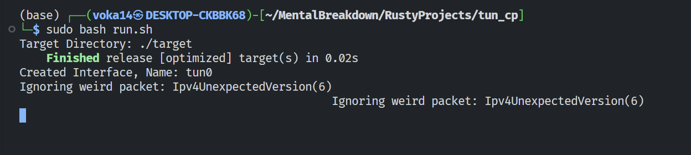
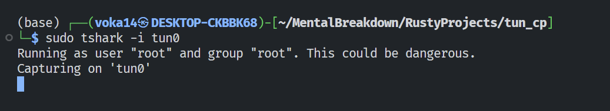
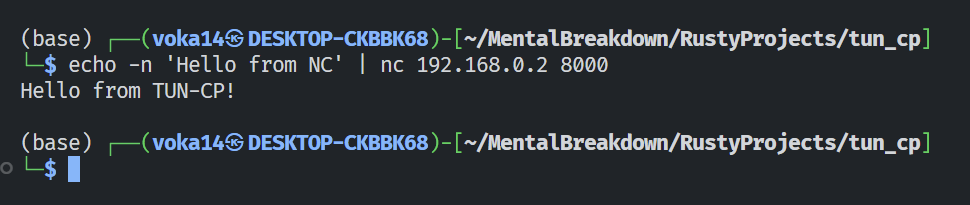
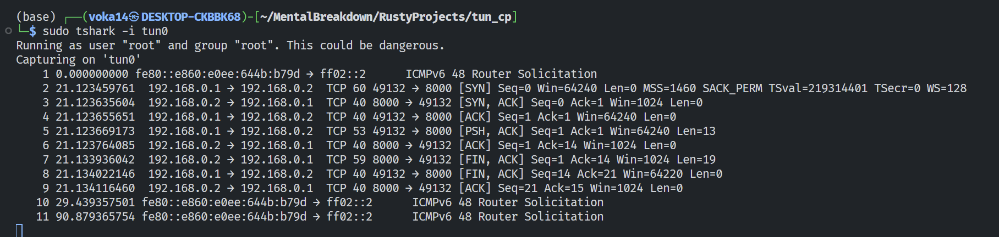
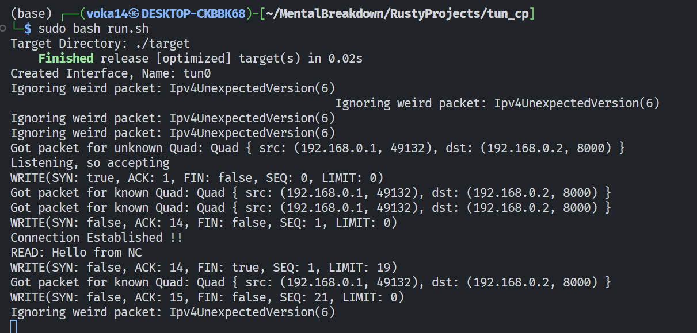

<p align="center">
  <a href="" rel="noopener">
 </a>
</p>

<h3 align="center">TUN-CP - A TCP stack using tun/tap on linux</h3>

<div align="center">

[]()
[]()
[]()
[](/LICENSE)

</div>


## 🧐 About <a name = "about"></a>

This is a func project that mimics TCP stack on the tuntap0 interface which provides communicaton between program space instead of the physical media.

## 🏁 Getting Started <a name = "getting_started"></a>

These instructions will get you a copy of the project up and running on your local machine for development and testing purposes.

### Prerequisites

<b>NOTE:</b> <p>This is a dry run dont do this everytime..</p>

Adding a tuntap interface on any linux system (this will act as our NIC).
```
sudo ip tuntap add mode tap tun0
```

Enabling the tap0 interface.
```
sudo ifconfig tun0 up
```

Assign an IP to tap0 interface.
```
sudo ip addr add 192.168.0.1/24 dev tun0
```

<!-- sudo ip link set up dev tap0 -->

### Installing

Cloning this repo on your local machine

```
git clone <this_repo>
```

Moving into the cloned directory

```
cd tun_cp
```


## 🎈 Usage <a name="usage"></a>

To run this program make sure to execute the following command in the <b> tun_cp
</b> folder
```
sudo bash run.sh
```


To capture the communication between two programs the following command is needed
```
sudo tshark -i tun0
```


To send TCP packets to this newly created NIC we need to run te following command
```
echo -n '<message>' | nc 192.168.0.2 8000
```


Actual packets send during the communication:
tshark:

tun_cp:



## ⛏️ Built Using <a name = "built_using"></a>

- [Rust](https://www.rust-lang.org/)
- [tun-tap](https://docs.rs/tun-tap/latest/tun_tap/)
- [etherparse](https://docs.rs/etherparse/latest/etherparse/)
- [bitflags](https://docs.rs/bitflags/latest/bitflags/)
- [nix](https://crates.io/crates/nix/dependencies)

## ✍️ Authors <a name = "authors"></a>

- [@LowLevelLore](https://github.com/LowLevelLore) - All Idea & No Work

## 🎉 Acknowledgements <a name = "acknowledgement"></a>

- [IP](https://datatracker.ietf.org/doc/html/rfc791/)
- [Jon Gjengset](https://www.youtube.com/watch?v=bzja9fQWzdA)
